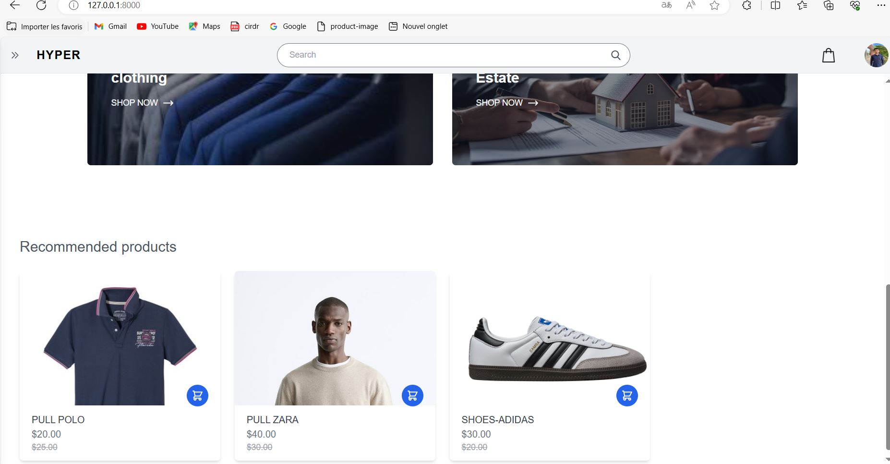

# HYPER: An E-commerce Application Built with Laravel

<<<<<<< HEAD
HYPER is an e-commerce application built using Laravel. It allows users to browse products, add them to their cart, and make purchases securely.

## Features

- **User Authentication:** Users can sign up, log in, and manage their accounts securely.
- **Product Browsing and Search:** Users can easily browse products and search for specific items.
- **Shopping Cart Functionality:** Users can add products to their cart and proceed to checkout.
- **User Profile Settings:** Users can manage their profile information and preferences.
- **Admin Dashboard:** Administrators have access to a dashboard to manage products, categories.

## Technologies Used

- **Laravel**: A web application framework used for building the backend of the application.
- **Tailwind CSS**: A utility-first CSS framework for styling the application.
- **Blade Components**: Laravel's templating engine for building reusable UI components.
- **MySQL Database**: Used for storing application data.

## Installation

To install and run HYPER locally, follow these steps:

1. Clone the repository: `git clone https://github.com/your_username/hyper.git`
2. Navigate to the project directory: `cd hyper`
3. Install dependencies: `composer install`
4. Set up the environment configuration: Rename `.env.example` to `.env` and configure database settings.
5. Generate application key: `php artisan key:generate`
6. Migrate and seed the database: `php artisan migrate --seed`
7. Serve the application: `php artisan serve`

Once the application is running, you can access it in your web browser at `http://localhost:8000`.

<!-- Add images here -->
## Screenshots

Here are some screenshots of the HYPER application:

=======

HYPER is an e-commerce application built using Laravel. It allows users to browse products, add them to their cart, and make purchases securely.

## Features

- **User Authentication:** Users can sign up, log in, and manage their accounts securely.
- **Product Browsing and Search:** Users can easily browse products and search for specific items.
- **Shopping Cart Functionality:** Users can add products to their cart and proceed to checkout.
- **User Profile Settings:** Users can manage their profile information and preferences.
- **Admin Dashboard:** Administrators have access to a dashboard to manage products, categories.

## Technologies Used

- **Laravel**: A web application framework used for building the backend of the application.
- **Tailwind CSS**: A utility-first CSS framework for styling the application.
- **Blade Components**: Laravel's templating engine for building reusable UI components.
- **MySQL Database**: Used for storing application data.

## Installation

To install and run HYPER locally, follow these steps:

1. Clone the repository: `git clone https://github.com/your_username/hyper.git`
2. Navigate to the project directory: `cd hyper`
3. Install dependencies: `composer install`
4. Set up the environment configuration: Rename `.env.example` to `.env` and configure database settings.
5. Generate application key: `php artisan key:generate`
6. Migrate and seed the database: `php artisan migrate --seed`
7. Serve the application: `php artisan serve`

Once the application is running, you can access it in your web browser at `http://localhost:8000`.

## Laravel

Laravel is a web application framework with expressive, elegant syntax. We believe development must be an enjoyable and creative experience to be truly fulfilling. Laravel takes the pain out of development by easing common tasks used in many web projects.

- [Laravel Documentation](https://laravel.com/docs)
- [Laravel Bootcamp](https://bootcamp.laravel.com)
- [Laracasts](https://laracasts.com)

## Screenshots

Here are some screenshots of the HYPER application:

